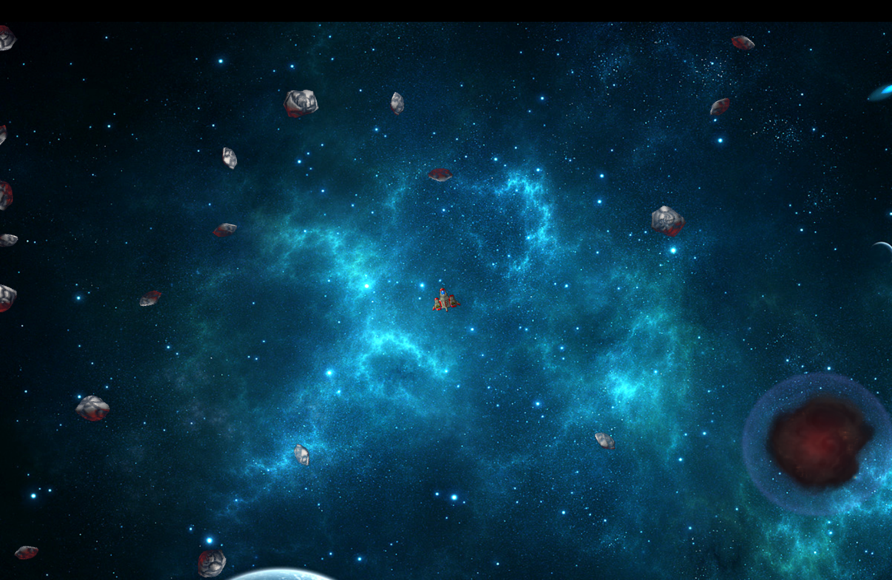

# Asteroids Game in C++ with SFML

This is a simple implementation of the classic Asteroids game using C++ and SFML (Simple and Fast Multimedia Library).

## How to Play

- Use the **Right** and **Left** arrow keys to rotate the player's spaceship.
- Press the **Up** arrow key to activate thrust and move forward.
- Press the **Space** key to shoot bullets and destroy asteroids.
- Avoid collisions with asteroids to stay alive.

## Screenshots



## Prerequisites

Make sure you have SFML installed on your system. You can download SFML [here](https://www.sfml-dev.org/download.php).

## Build and Run

```bash
g++ -std=c++11 -o asteroids main.cpp -lsfml-graphics -lsfml-window -lsfml-system
./asteroids
```

## Acknowledgments

- SFML - Simple and Fast Multimedia Library
- Original concept of the Asteroids game
